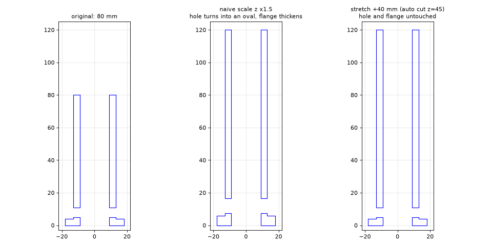

# stl-stretch

> Lengthen an STL or 3MF part for 3D printing **without distorting its holes, threads or chamfers**.
> No CAD source needed: cut the mesh where the cross-section is constant, shift one half, fill the gap.

You downloaded a model, it is 10 cm too short, and all you have is an STL. Scaling the mesh stretches every
feature with it: round holes turn into ovals, flanges get thicker. `stl-stretch` only adds material where the part is a
straight prism, so everything else stays exactly as designed.



## How it works

1. **`find_cut`** samples the cross-section area along the axis and picks the middle of the longest constant run.
2. **`stretch`** cuts the mesh at that plane (manifold booleans), shifts the upper half by `--delta`,
   extrudes the section to fill the gap, and welds everything into one watertight mesh.
3. It verifies itself: final length = original + delta, final volume = original + section area x delta.

Built on [trimesh](https://trimesh.org) and manifold3d. Reads and writes STL, 3MF, OBJ and anything else trimesh supports.

## Quick start

```bash
uv sync
uv run python src/stretch.py part.stl longer.stl --axis y --delta 107          # auto cut
uv run python src/stretch.py part.stl longer.stl --axis y --delta 107 --cut 35 # explicit cut
uv run python examples/demo.py      # regenerates the image above from a generated part
uv run python tests/test_stretch.py
```

Multi-body file? `--body N` stretches only body N. Not sure where it is safe to cut? `src/sections.py part.stl` prints the
section area along Y, so you can see the constant ranges yourself.

## Other small tools (command line, all in `src/`)

| Script | What it does |
|---|---|
| `inspect_stl.py` | Bounding box, watertightness and body count of every STL under `input/` |
| `sections.py` | Cross-section area along an axis (finds the ranges where stretching is safe) |
| `orient.py` | Scores the 6 axis-aligned print orientations by overhang area vs bed contact |
| `preview.py`, `section_plot.py` | Headless PNG renders and section plots, handy to check a result without opening a slicer |
| `examples/make_plates.py` | Arranges oriented parts on a 256 mm bed and writes one 3MF per project, ready for Bambu Studio |

## Real-world use

I used it to lengthen a ratcheted toothpaste-tube squeezer so it takes a 16 cm wide bag (tube slot 63 mm to 170 mm),
and to widen a kids' toothpaste stand for a 62 mm tube. Both models are by other authors on MakerWorld and are **not** in
this repo, check their licenses before redistributing anything derived from them:

- [Ratcheted Toothpaste Tube Squeezer](https://makerworld.com/en/models/30246-ratcheted-toothpaste-tube-squeezer) (remix by Roland Deschain)
- [Stand for Toothpaste V5.0 (Kids' version)](https://makerworld.com/en/models/831100-stand-for-toothpaste-v5-0-kids-version) (3DKUB)

`examples/make_plates.py` is my personal script for those two; paths and measures are specific to them.

## Limits

- The part must be a straight prism at the cut plane, along one axis at a time. Organic shapes have no such plane and
  `find_cut` will say so.
- Equal cross-section area does not strictly prove equal outline, so look at a render before printing an unusual part.
- It edits geometry only. Slicer settings, supports and material are your call.

Open source, MIT license (see [LICENSE](LICENSE)).
